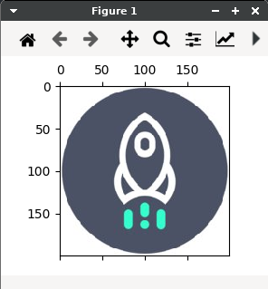
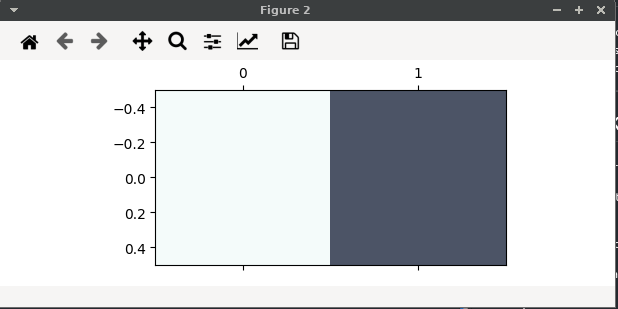

# Proposito do projeto
- 1 realizar o download das imagens/wallpaper a partir de um Json
- 2 fazer a consulta ao Json via Curl, urllib ou alguma coisa do tipo (nao consegui ainda wtf)
- 3 identificar cor principal do wallpaper(img baixada)

# Results
### Primeiro input
 

### Resultado esperado

	rgb (244, 251, 250)
	rgb (76, 84, 102)

---------------------------------
# Mind trick (TODO list)
- done - avaliar json de retorno com as informacoes
- done - encontrar o link da imagem
- grepar todos (fiz a consulta navegando entre a estrutura de dado fornecida, nao foi necessario usar o ferramental de texto, mudança de perpectiva) -> consulto o arquivo completo
- done - acessar corretamente a tupla com o valor de download
- done - baixar encaminhando pro path indicado

- ao inves de consultar arquivo, fazer o get direto na url ??? *urllib* -> ainda nao consegui isso
- explorar mais a estrutura, json recebida (por arquivo ou request http) [
	-> formato
	-> tamanho/resolucao
	-> ???
]

- done - identificar a(s) cor dominante ali
- done - mostrar o valor RGB da(s) cor domintantes <i> 255,255,255
- done - plotar a(s) cor dominantes

## exemplo do curl
	$ curl https://unsplash.com/napi/search/photos\?query\=desktop%20background\&xp\=\&per_page\=20\&page\=2 >> full.json

-----------------

# referencias p. analise da imagem

	https://adamspannbauer.github.io/2018/03/02/app-icon-dominant-colors/

	https://zeevgilovitz.com/detecting-dominant-colours-in-python

	https://www.dataquest.io/blog/tutorial-colors-image-clustering-python/